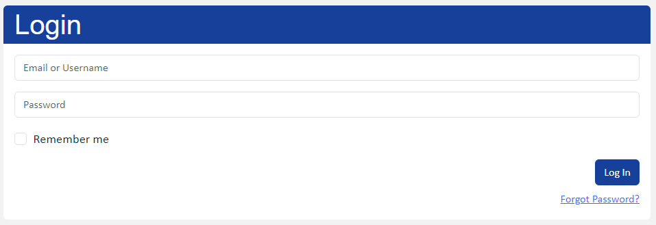
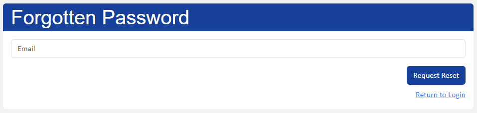
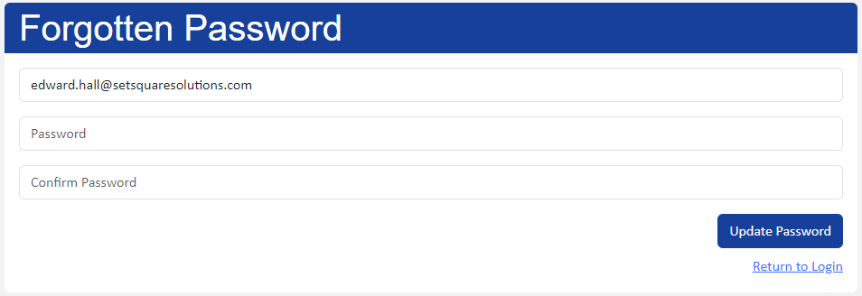

# Getting Started

## Logging in

To access the CMS go to [https://sandridge-pc.gov.uk/admin](https://sandridge-pc.gov.uk/admin)

Fill in your supplied username or email address and password. Then click the 
Log In button.

You can also check the “Remember me” box to stay logged in even after closing 
your browser.

## Resetting your password

If you have forgotten your password then click the “Forgot Password?” link below the log in button. You will be taken to a new page where you can enter your email address.

After entering your email a link will be sent to you that will allow you to choose a new password. This link will be valid for 60 minutes, afterwards you will need to request a new link.

After resetting your password by entering a new one and confirming it. You will be able to return to the login screen to log in using your newly chosen password.

