# Pages, News & Events

## Single View

### Left Column

After clicking on a piece of content to edit it, or after creating a new piece of content, you will be taken to its editor.

In the top left are three buttons:

* Save - saves all changes made, this must be clicked after you have finished editing the content.
* Delete - deletes the content permanently after confirmation.
* Advanced Editor - an alternate page editor which offers more control  over page layout and allows some custom code to be added for finer control. 
 Save any changes made before switching between the two Editors.

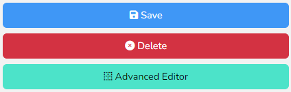

Below the buttons is the first group of inputs:

* Name - the name of the page shown in the CMS for your reference
* URL - the unique identifier for the content. Only use letters, numbers, hyphens as much as possible, many symbols cannot be used in URLs and can break links.
* Author - this will be set to the user who created the content. It is generally only relevant to news articles and events, where the author is displayed.
* Date posted - this will be set to the current date and time the content is created. But should be adjusted for news and events which are displayed in date order.
* State - this determines who can see the content.
    * Visible - everyone
    * Draft - admins only
    * Hidden - no one
* Template - should generally be left as “Default”. Some other templates are available for specific pages. More may be added in future if you require complex designs which cannot be handled by the CMS.

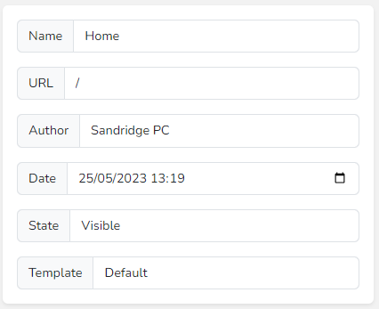

The next set of controls are the Meta details. These can be used to override what details appear in search engine results, these will be populated automatically if left blank:

* Meta Title - the name of the page, appears as the clickable blue link.
* Meta Description - the short description of the page, up to 155 characters.
* Meta Author - the author of the content.
* Meta Keywords - a comma separated list of terms you would expect people to type in to search engines to find this page.

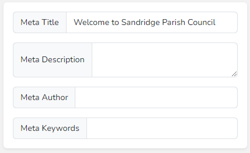

Finally in the left hand column is the featured image, this only applies to news and events, and sets the small image displayed in the list view of news/events before clicking into the full article. If left blank then the Sandridge crest will be used.

Click the blue button to choose an image, if an image has already been chosen then there will also be a black Clear button to delete that image.

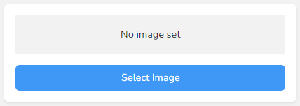

A window will pop-up showing a list of the current folders and files which exist on the CMS. Navigate to the relevant existing image by double clicking into folders.

When you have found the image you like, click on it and the click the confirm button, you can also double click it.

You can upload a new image by clicking the plus button in the bottom right and then clicking the Upload button. This will allow you to choose a new image from your computer.

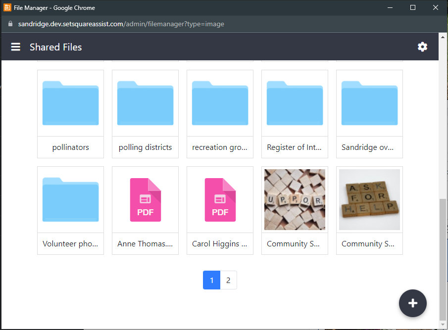

You can also create new folders from the plus button to organise your files.

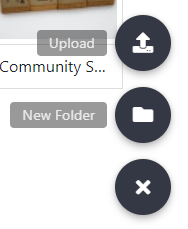

### Right Column

The first option on the right hand side of the page is the Carousel. This allows you to set the hero image or collection of images that fills the top of the page. If multiple images are supplied then these will automatically scroll through on a loop, arrows will also appear allowing for manual navigation. 

Start by clicking on the Add Slide button.

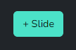

Some text will appear for the Slide Title and Slide Tagline. You can type some text into these to appear above the image if desired.

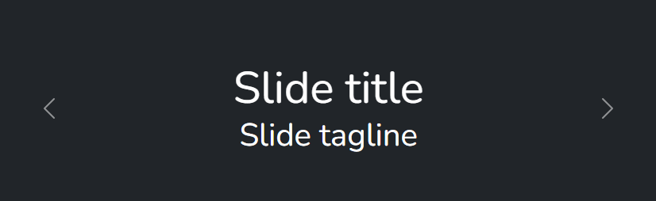

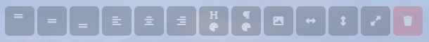

Along the top of the slide is a collection of additional controls. In order from left to right these control:

* Vertical text alignment:
    * Align the text to the top of the image
    * Align the text to the middle of the image
    * Align the text to the bottom of the image
* Horizontal text alignment (can be used with vertical):
    * Align the text left
    * Align the text centre
    * Align the right
* Set the colour of the heading text
* Set the colour of the tagline text
* Image alignment: It is generally best to use a percentage value, but a fixed px value can also be used, though this can lead to alignment issues on different sized devices
    * Set the horizontal alignment of the image
    * Set the vertical alignment of the image
    * Set the scale of the image
* Delete the slide

Below the carousel is the excerpt and full content editor. The excerpt can be used to add a short description to news and events in list view, before clicking into the full article.

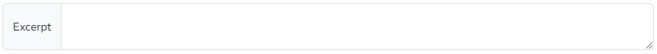

The full content editor works similarly to a Word document and is where you will add the bulk of the text and images you want to appear on a page.

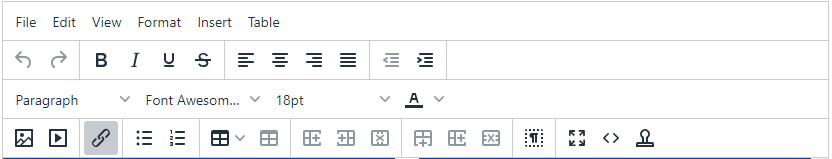