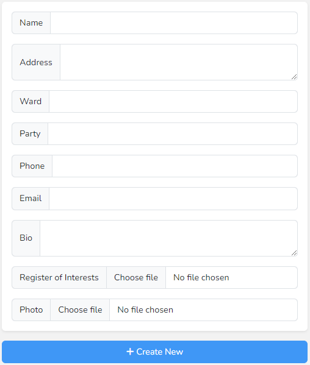
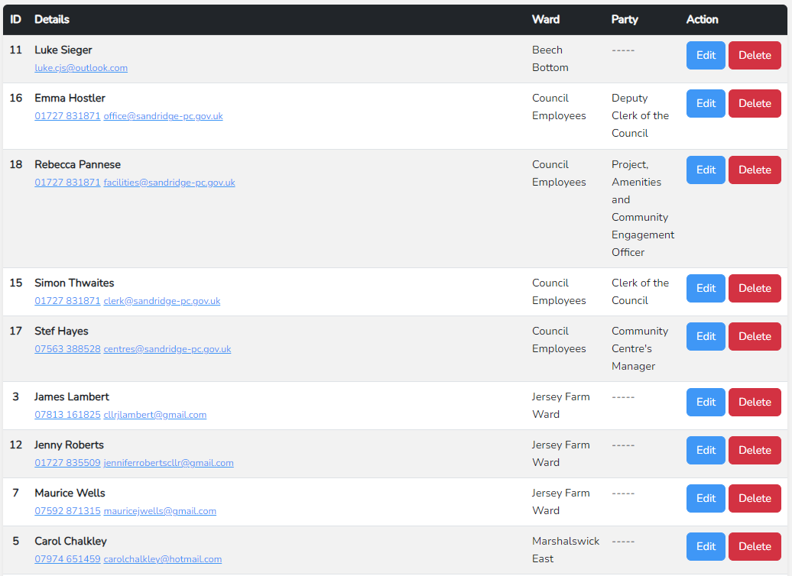

# List View - Councillors & Employees

When first clicking into this section you will be taken to the list view. On the left side is the form to create a new Councillor or Employee.

## Create New

The only required field when creating a Councillor is the Name. You can then supply any combination of other values depending on what is relevant to each person.

* Name - the name of the councillor or employee
* Address - their address
* Ward - their ward, this is also used to determine where they will appear on the website, this is covered under [Shortcodes](/other/shortcodes.md)
* Party - their party
* Phone - their phone
* Email - their email address
* Bio - a description about the person, this can be edited in more detail on their individual profile
* Register of interests - a PDF file that can be selected from your computer
* Photo - a JPG or PNG that can be selected from your computer

After filling in all details click the blue create new button.

## Search

Below the form to create new Councillors and Employees is the search bar, where you can search by any of the entered values: name, ward, phone etc.

## Existing List

On the right side of the page is a list of current Councillors and Employees grouped by Ward in alphabetical order. Along with their details are buttons to edit and delete them. As elsewhere, deletion is always confirmed.

