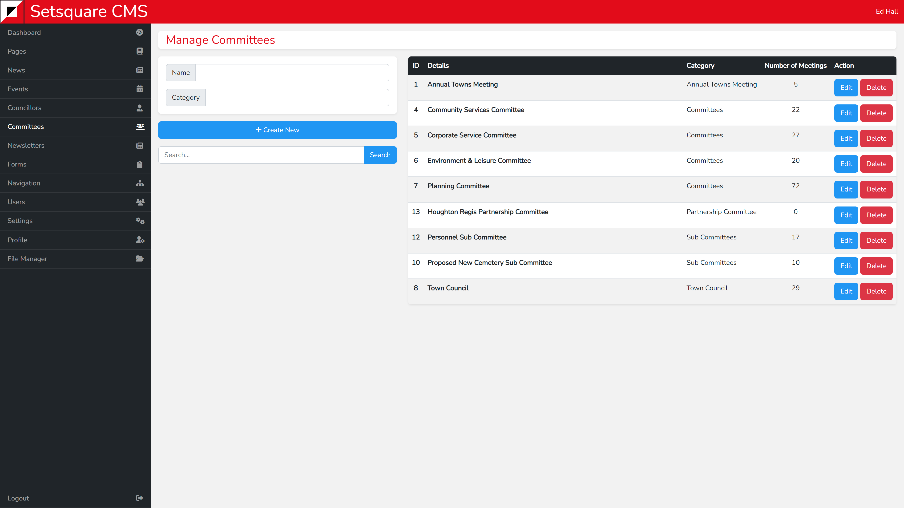

# List View - Committees

The list view on the left side of the screen contains a form to create a new committee, as with other pages. This form requires a unique name for the committee and a category. This will be used to determine where the committee appears on the website, covered under [Shortcodes](/other/shortcodes.md).

On the right side is the list of current committees along with their category, and number of meetings. You can click edit to amend the details of each committee and create meetings.

