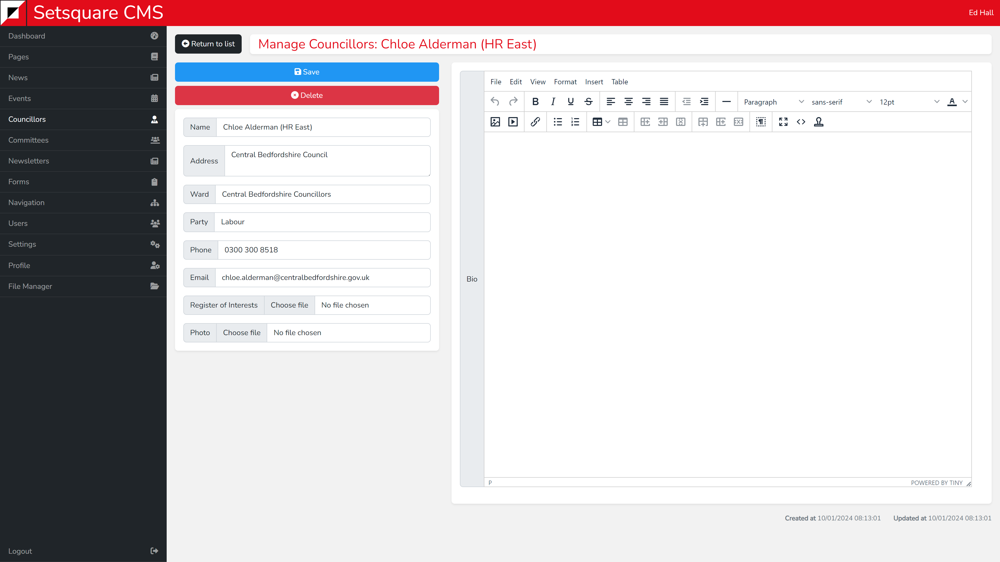

# Single View - Councillors

After clicking on a Councillor to edit them you will be taken to their individual profile. Here you can adjust the values used to initially create them. 

On the left side is the majority of simple fields such as name, address etc. On the right is the full bio editor which is enhanced with additional Word like controls, allowing for more control over the layout of the bio.

If a register of interest or photo has already been attached to the Councillor then this will be displayed below the relevant field. Selecting a new photo or register of interest will replace the current one.

