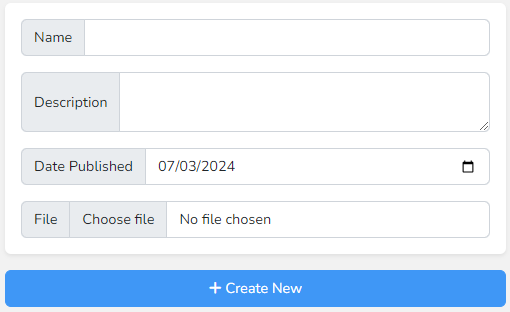

# List View - Newsletters

The list view for newsletters contains a form to create a new newsletter on the left hand column and a list of existing newsletters on the right.

To create a new newsletter; fill in the name, date published and select a PDF file to upload. The description is optional but will be displayed alongside the newsletter if included.

When the newsletter is generated, the first page of the PDF file will be automatically extracted and used as a thumbnail for the newsletter.

The list of existing newsletters displays the basic details about each one including a thumbnail of the cover for easy identification. As with other sections of the CMS you are able to edit and delete existing newsletters.

