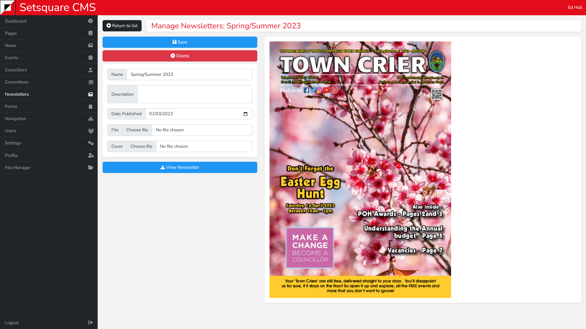

# Single View - Newsletters

Clicking in to edit an existing newsletter will allow you to overwrite the details used to initially create that newsletter.

On the left you will see a collection of the same fields used to create the newsletter, that can be updated with different values if required. There is an additional field allowing you to manually upload a new cover thumbnail image, if the automatically generated one is not appropriate.

On the right side is a preview of the cover thumbnail.

Below the form is a button allowing you to preview and download the newsletter.

