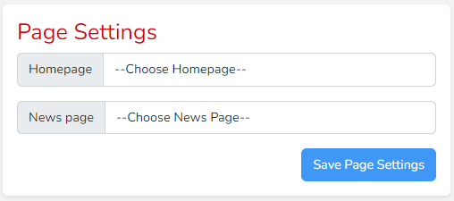
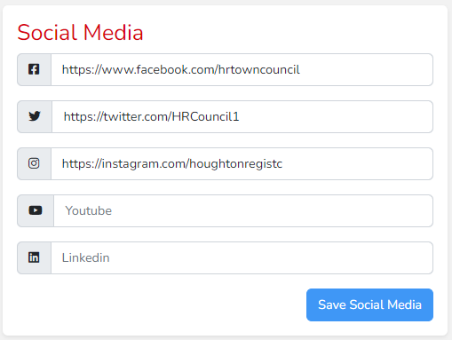
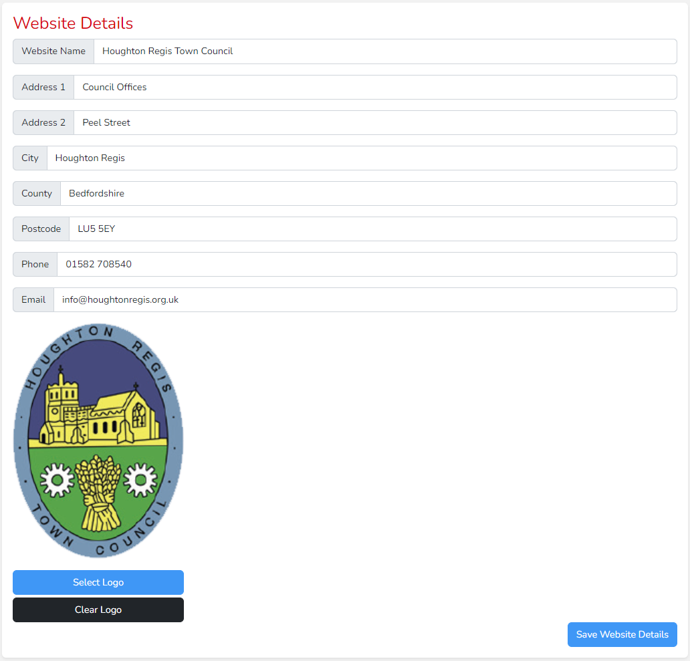
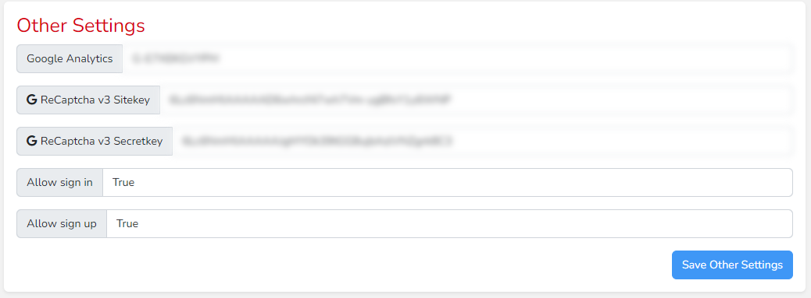

# Settings

Settings are split up into four groups. When editing and saving settings in one group, remember that any settings changed in another group will not be saved. So work through them one group at a time. 

## Page Settings

The first group is page settings, here you can choose the homepage and page which displays news articles.

## Social Media

Within Social Media you can link to your social media accounts. Simply copy and paste the url from your profile into the relevant box and an icon will appear in the website footer linking
to that profile.

## Website Details

Website details contains general information about the site which is displayed in the header and footer. Here you can set the website name, address, contact details and logo.

## Other Settings

Other Settings should generally be ignored as they are used for linking to other services and the currently supplied values are necessary for these services to work.

Google Analytics allows tracking of visitors to gain insights about most popular pages, demographics and other useful information. These reports are access through the Google Analytics website. 

ReCaptcha is a service which prevents bots from filling in forms. 

Allow sign-in and allow sign-up are only relevant if a secure area of the website has been created for visitors of the website to use.

