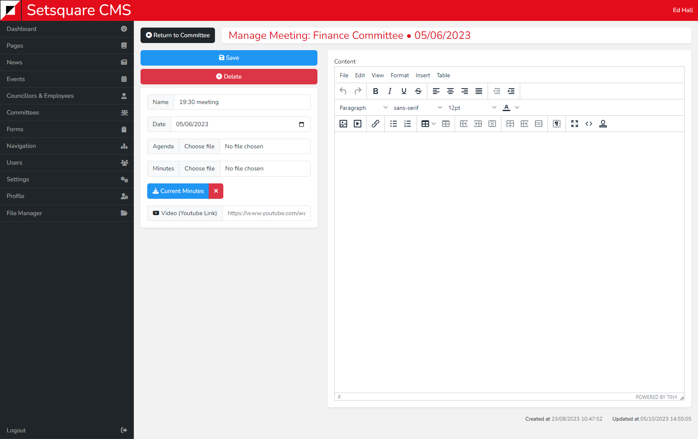

# Meetings View - Committees

After clicking to edit a meeting you will be taken to the a new page to upload documents to that meeting. You can also give the meeting a name and add content.

The name could simply be the times the meeting takes place or could be more specific.

Clicking to upload an agenda or minutes will allow you to select the file from your computer. You are also able to paste in a YouTube link if the meeting has been recorded.

You can download existing minutes or agendas by clicking on the blue "Current Minues" or "Current Agenda" button.

You can also delete the existing minutes or agendas by clicking the red X button next to them. If you are replacing existing files with new ones then you do not need to first delete the existing one, it will be overwritten automatically.

Click save after making all your changes. You can the click the Return to Committee button in the top left to go back to the committee you were last editing.

