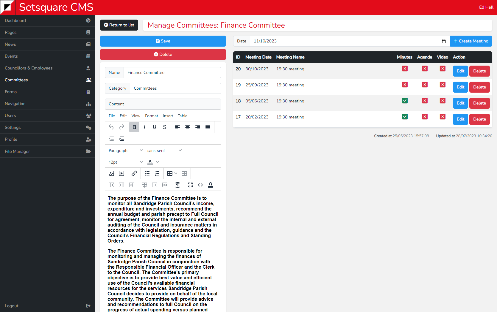

# Single View - Committees

After clicking into a committee you will be able to edit its details and schedule meetings. On the left are fields to amend the name and category of the committee, along with a content editor. After making changes here click the save button.

On the right is the list of current meetings and a field to enter a date to schedule a new meeting.

The meetings are listed in date order from newest to oldest, and contain red or green check boxes to indicate if an agenda, minutes or video have been added to that meeting.

