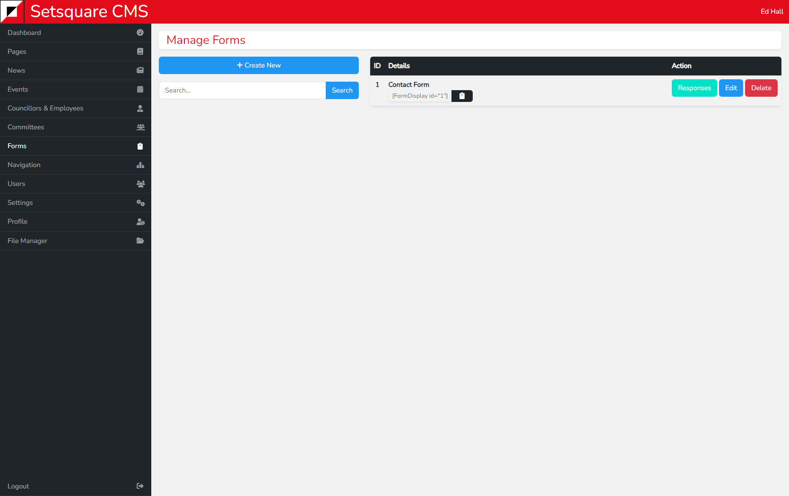

# List View - Forms

The list view for forms contains a button to create a new form, no values must be supplied. As well as a search bar to search by form name.

On the right side is the list of forms. You will see the name of the form, the shortcode which can be copied and pasted into a page editor to display it on that page, and the usual edit and delete buttons along with a new Responses button.

The responses button will take you to a page containing a list of all submissions for that form. Forms must still be responded to via email, where they will also be sent. But it can be useful to have a record of them on the CMS, particularly for forms where people are submitting details and documents.

