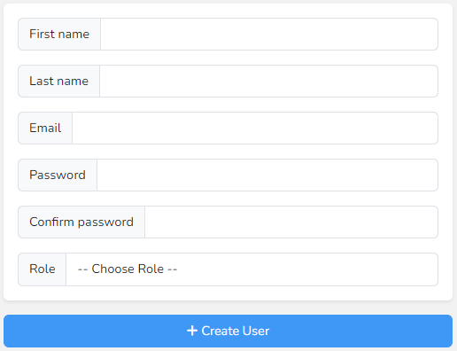
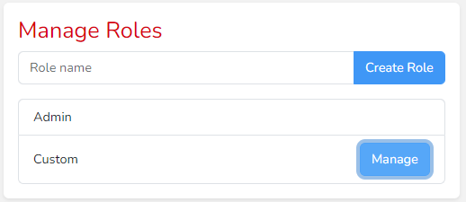
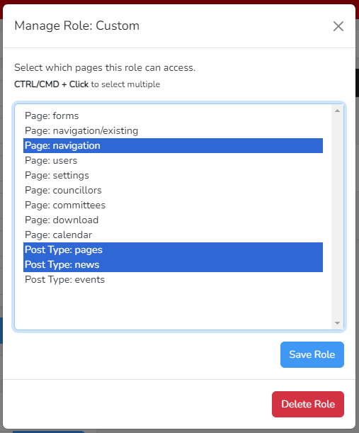
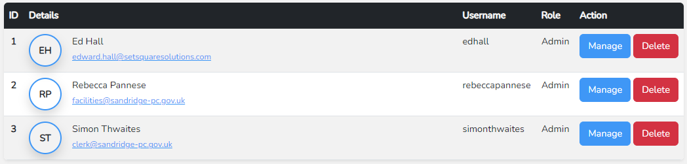

# Users - Users & Profile

The users page is where you will create other accounts that have access to the CMS to manage the website. 

On the left is a form to create a new user. Set a first and last name for them, enter their email address and two matching passwords. Finally select a role. The default Admin role provides access to everything, though other custom roles can be created.

Below the form is a search bar, you can search by name, email or username.

## Roles

Below the search bar is the form to create custom roles. Start by entering the name of the role, this must be unique. Then click the create role button.

The role will appear in the list below, where you can click the manage button to choose what pages this role has access to in the pop-up window.

In the pop-up hold the CTRL key on the keyboard and click on the pages that you want this role to have access to. You can also CTRL+click a selected page to 
deselect it. Click the Save role button when done.

It is also possible to delete roles from the pop-up, any user who was set to that role will become a full admin after it is deleted.

## Existing Users

On the right side of the page is the list of current users. You can click to manage a user to change their details such as name, email or password. You can also delete users.

You will not be able to manage or delete yourself. Instead go to the [profile](/users-and-profile/profile.md) option in the menu to change your own details.

