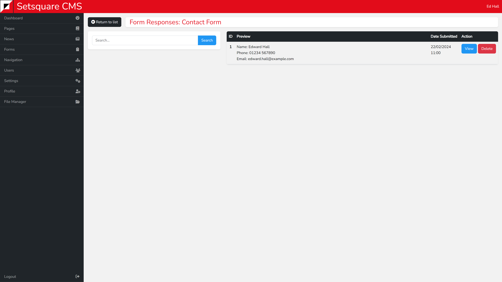
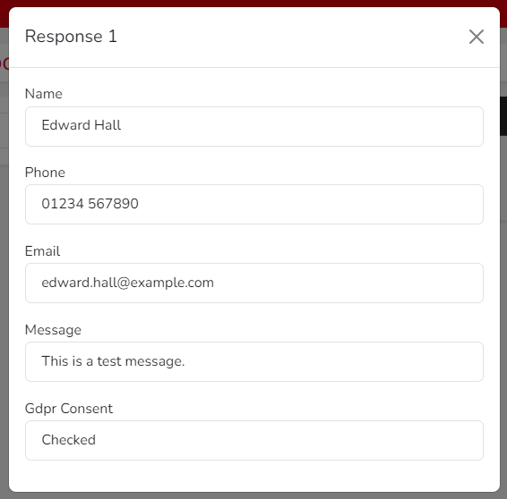

# Responses View - Forms

After clicking the responses button for a form you will be taken to a page that lists all messages sent through it. 

The list contains some basic information about the submission. 

A Captcha score from 0.0 to 1.0 will always be shown if Captchas have been enabled in the settings, a lower score means that the submission is more likely to be spam. Anything below 0.5 has a high probability of being spam.

The first two fields form the form will be shown as well. This will vary depending on the form. If Captchas haven't been enabled then the first three fields from the form will be shown instead, with an additional one replacing the slot taken by the Captcha.

Clicking the view button will pop-up a window containing the full details of the form submission.

