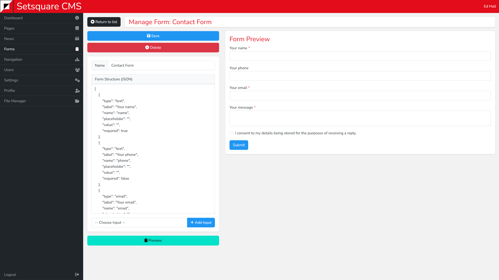

# Single View - Forms

Forms may look intimidating to create, but they are fairly simple once you understand them. 

They are built using a format call JavaScript Object Notation (JSON), which is a simple text file that is designed to be interpreted by computers but remain readable and understandable by humans. 

JSON consists of collections of square and curly brackets that are filled with values. 

In the case of forms each set of brackets represents an input within the form, and the values represent parameters which define how that input should behave.

## Creating Structure

On the left is a field to set the name of the form, this will appear in the subject line sent to you. There is also a form structure input and a choose input dropdown.

Ignore the form structure to start with, this will be populated as you choose inputs from the dropdown. You can choose a variety of options such as text, email, date, checkbox.

As you select inputs you will see that the structure starts to populate. You will need to fill in the values with the information you want to be displayed. 

The values you need to enter vary depending on input type. Here is an overview of the most common:

Type - this will be added for each input and must remain as it is
Label - the value which appears above the input to explain what information is required e.g. Your name
Name - a unique identifier for the input. 
   This can be anything as long as it is only used once per form. Keep to letters and numbers only. It is a good idea to make it relevant to what is being entered into the field
Placeholder - an example of what could be added to the field. Disappears when the user starts to type.
Value - a prefilled value that can be changed by the user.
Required - a True or False value that determines if the user is forced to fill in that field before submitting the form.

You can read about each input in more detail [here](/forms/single.md?id=in-depth-values)

## Previewing Forms

At the bottom is a preview button which will update the form preview in the right column.

If the preview fails to load then there is something wrong with the structure that you have created. Try checking for any missing commas or quotation marks.

## In-Depth Values

As well as the common values that you will need to enter, depending on the input you have selected, additional unique values can be supplied. Below is an overview of each input type and what can be supplied.

### Text

A `text` input is a simple textbox that can be filled with alphanumeric characters and symbols. It is a general purpose input that can be filled with almost anything.

    {
        "type": "text",
        "label": "", 
        "name": "",
        "placeholder": "",
        "value": "",
        "required": false
    }

---

### Textarea

A `textarea` input is similar to a `text` input, it varies in that it will accept multiple lines of text allowing for longer text to be supplied.

    {
        "type": "textarea",
        "label": "",
        "name": "",
        "placeholder": "",
        "value": "",
        "required": false
    }

---

### Email

An `email` input is also similar to a `text` input, it accepts alphanumeric characters and numbers. But will also force the supplied data to include an @ symbol for it to be a valid email address.

    {
        "type": "email",
        "label": "",
        "name": "",
        "placeholder": "",
        "value": "",
        "required": false
    }

---

### Password

A `password` input is the same as a text input but the entered characters will be obscured with asterisks.

    {
        "type": "password",
        "label": "",
        "name": "",
        "placeholder": "",
        "value": "",
        "required": false
    }

---

### Date

A `date` input will display a calendar date picker to the user, a date can also be manually typed in. When supplying a placeholder or default value the format should follow `YYYY-MM-DD`.

    {
        "type": "date",
        "label": "",
        "name": "",
        "placeholder": "",
        "value": "2023-07-24",
        "required": false
    }

---

### Time

A `time` input will display a clock picker to the user, a time can also be entered manually. When supplying a placeholder or default value the format should follow `HH:MM:SS`. This should be in 24 hour time, the seconds are optional and can be excluded `HH:MM`.

    {
        "type": "time",
        "label": "",
        "name": "",
        "placeholder": "",
        "value": "16:55",
        "required": false
    }

---

### Datetime

A `datetime` input is a combined date and time input that will display both a calendar and clock to the user, values can also be entered manually. When supplying a placeholder or default value the format should follow `YYYY-MM-DD\THH:MM:SS`. The `\T` tells the system where the date ends and the time starts. The time is in 24 hour format and seconds are optional and can be excluded.

    {
        "type": "datetime-local",
        "label": "",
        "name": "",
        "placeholder": "",
        "value": "2023-07-24\T16:55",
        "required": false
    }

---

### Number

A `number` input will only allow whole or decimal numbers to be supplied, either positive or negative. Number contains several unique values. 

* `min` is the smallest value that you wish to allow
* `max` is the largest value that you wish to allow
* `step` affects the type of number that can be entered. 
  e.g. `step="0.1"` would allow numbers to be entered in increments to 1 decimal place. **0.1, 0.2, 0.3, 0.4 etc**.
  e.g. `step="5"` would allow whole numbers to be in multiples of 5. **0, 5, 10, 15 etc**.

    {
        "type": "number",
        "label": "",
        "name": "",
        "placeholder": "",
        "value": "",
        "min": "",
        "max": "",
        "step": "",
        "required": false
    }

---

### Tel

A `tel` input is used to accept a phone number. It contains an additional pattern value that can be populated to only accept numbers which match that pattern. The pattern uses Regular Expressions to determine what is a valid or invalid phone number. These can be complex to learn so may be best left blank.

An example of a regular expression would be: `^(\+44|0)[0-9]{4}(\s|)[0-9]{6}`. This would match a phone number starting with either +44 or 0, followed by 4 more numbers, an optional space, and finally an additional 6 numbers.

    {
        "type": "tel",
        "label": "",
        "name": "",
        "placeholder": "",
        "value": "",
        "pattern": "",
        "required": false
    }

---

### File

A `file` input allows a user to upload one, or more files if the multiple value is set to true.

    {
        "type": "file",
        "label": "",
        "name": "",
        "required": false,
        "multiple": false
    }

---

### Hidden

A `hidden` input simply contains an alphanumeric value that will not be displayed to the user. This can be useful for when you need to see some information after a form has been submitted that isn't relevant to the user filling it in.

    {
        "type": "hidden",
        "name": "",
        "value": ""
    }

---

### Checkbox

A `checkbox` input will display a checkbox to the user. This can be useful for getting yes or no answers to set questions. For example ensuring that the user has agreen to terms and conditions before submitting the form.

The checked value can be set to true to make the box checked by default.

    {
        "type": "checkbox",
        "label": "",
        "name": "",
        "value": "Checked",
        "required": false,
        "checked": false
    }

---

### Radio

A `radio` input will display a list of multiple choice buttons. e.g. &bull; Yes &bull; No &bull; Maybe.

The input contains an options value with an additional layer of brackets. Copy and paste the curly braces to create multiple options and separate them with a comma. Set selected to true for one option to make this one be chosen by default.

    {
        "type": "radio",
        "label": "",
        "name": "",
        "required": false,
        "options": [
            {
                "value": "Option 1",
                "selected": true
            },
            {
                "value": "Option 2",
                "selected": false
            }
        ]
    }

---

### Select

A `select` input will display a dropdown list to the user. It is populated in a similar way to (Radios)[/forms/single.md?id=radio] with an options value that contains an additional layer of brackets.

Copy and paste the set of curly braces and separate them with a comma to create your list of options.

The multiple value can be set to true to allow multiple options to be picked by the user.

    {
        "type": "select",
        "label": "",
        "name": "",
        "required": false,
        "multiple": false,
        "options": [
            {
                "value": "Option 1",
                "selected": false
            },
            {
                "value": "Option 2",
                "selected": false
            }
        ]
    }

---

### Button

A `button` input adds a non functioning button to the form. This would need to be made functional with additional custom code, so this input can generally be ignored. The class vlaue can be populated with CSS classes to customise the colour and look of the button. Classes should be separated with a space.

Some examples of classes are:

* `btn-primary` the primary theme colour
* `btn-secondary` the secondary theme colour
* `btn-success` green
* `btn-warning` yellow
* `btn-danger` red
* `btn-info` blue
* `btn-dark` dark grey
* `btn-light` light grey

`text-` classes can also be added using the same suffixes as above to change the colour of the button's text.

* `text-primary`
* `text-secondary`
* etc

    {
        "type": "button",
        "name": "",
        "value": "",
        "class": "btn btn-secondary"
    }

---

### Submit

A `submit` input adds a functioning button to the form which will submit and complete it. All of the classes from [Buttons](/forms/single.md?id=button) apply here.

    {
        "type": "submit",
        "name": "submit",
        "value": "Submit",
        "class": "btn btn-primary"
    }