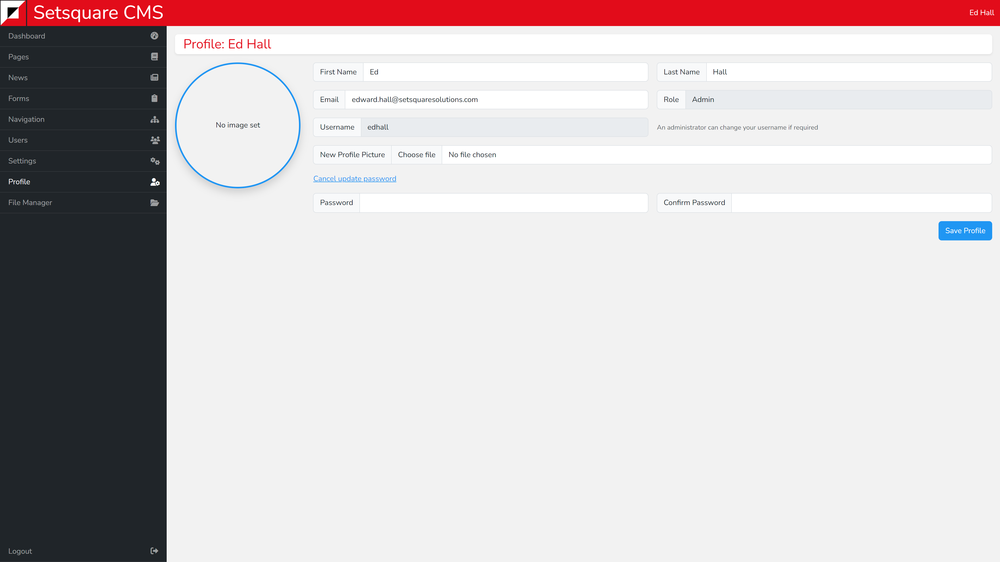

# Profile - Users & Profile

Your profile is where you will amend your own details. 

You are able to update your name, email address and profile picture. You can also change your password by clicking the blue Update Password link.

When updating your email address you must pick a new email that is not currently in use by another user on the system.

You will also see your username and role. These cannot be changed by yourself for security purposes. Instead they must be changed by another user with admin or custom permissions to edit users.

Similarly to email address, the new username must not currently be in use by another user.

